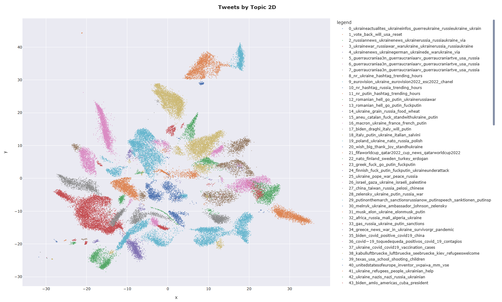
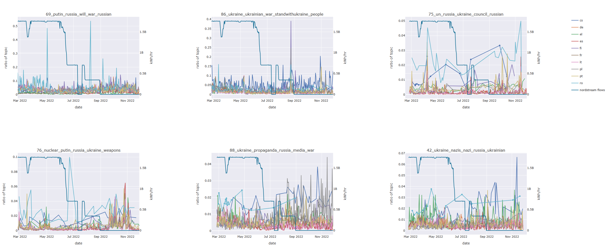
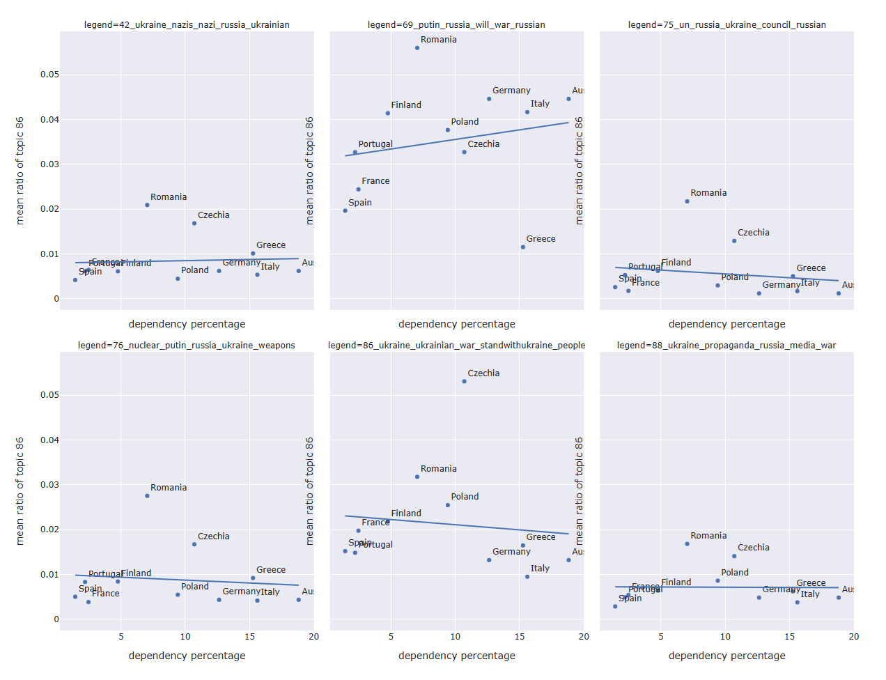

# Sentiment-analysis-on-Russia-Ukraine-war
|  | 
|:--:| 
| *2D topic modelling cluster map for the Ukraine Conflict Twitter Dataset* |

## Summary
Analyzing the correlation between public sentiment and European gas flow fluctuations during the Ukraine war with topic modeling and regression models in BASC0005 Quantitative Methods 2: Data Science and Visualisation.

## Aim and Motivation
The escalating Russia-Ukraine war presented a unique opportunity to analyze the intricate interplay between geopolitics and public sentiment. We particularly interested in understanding how the manipulation of natural gas flows to the continent could influence public opinion towards the two governments and its potential impacts on political decisions.

## Hypothesis
* H0 = A decrease in gas import to Europe will be correlated with a decline in topic discussion related to support towards Ukraine or an increase in discussion related to support towards Russia.
* H1 = There is no relationship between the observed variables.

# Measurement
* **European Gas Import**: To quantify the impact of Russian gas supply disruptions on European energy markets, we utilized the daily natural gas flow data from the Nord Stream 1 pipeline. This pipeline was a critical conduit for Russian gas exports to Europe prior to its suspension. By analyzing changes in gas flow volumes, we were able to assess the extent to which Russian gas supply reductions affected European energy security.
* **Public sentiment**: To examine public sentiment towards the Russian-Ukrainian War, we conducted a sentiment analysis of Twitter discussions. We collected a dataset of tweets posted between February 24th and November 28th, 2022, which encompassed the initial invasion and subsequent developments. Using a combination of NLP techniques and sentiment analysis algorithms, we then classified tweets into different topic and attitudes for further analysis.

## Methodology
We employed several SOTA models and data processing techniques to analyze the correlation between public sentiment on social media and fluctuations in European gas imports from Russia.
To accomplish this, we employed a series of approaches:

1.	Data collection & Preprocessing
2.	Extracting semantic features
3.	Topic modeling (Clustering & Dimensionality reduction)
4.	Statistical analysis (Linear regression & Correlation analysis)
5.	Data visualization

Code is available at this [repo](https://github.com/elyxlz/Ukraine-Twitter-Analysis).

# Finding & Conclusion
|  | 
|:--:| 
| *Relationship between the ratio of 6 selected topics of interest and the Nord Stream gas flows* |
|  | 
| *Relationship between the 6 selected topics of interest tweet counts and Russian gas dependency ratio* |
 

Through this analysis, we gained valuable insights into the complexities of public sentiment analysis and its potential applications in understanding geopolitical events. While our analysis did not yield statistically significant results, the insights gained from this project provide a solid foundation for future research.

## Author
Elio Pascarelli, Laura Cabrey, Yi Lien

## Reference
Full report can be access [here](https://plain-bovid-a7d.notion.site/Online-Learning-Language-Investigation-Enterprise-cbdfe65f2b0b437b8f854eab66b811a3).
Code is available at this [repo](https://github.com/elyxlz/Ukraine-Twitter-Analysis).
